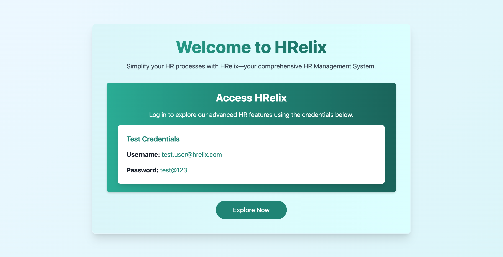

# HRelix - HR Management System


## Overview

This project is a backend service built using `Spring Boot` and `Java`. It exposes RESTful API endpoints for managing
resources in a `PostgreSQL database`. The application is containerized using `Docker`, enabling easy deployment and
scaling.

For Security of endpoints and app, This project implements `spring-security`. All endpoints (if required) are secured to
be accessed by only authentic users.

### System Architecture


### Documentation & Deployed Link

> Check out all the documentations of the endpoints from this link below :)

[](https://documenter.getpostman.com/view/38347451/2sAXqy4fXM)

> This project is hosted on AWS you can test it from this link below :)

[](https://hrelix.blufin.co.in/)

### Project Dependencies

- **Java**: `opne jdk: v22.0`.
- **Spring Boot**: `v3.3.3`.
- **PostgreSQL**: `v16.0`.
- **Docker**: with `docker-compose v3.0`.
- **Maven**: `v4.0.0`.

### Features

- RESTful API endpoints for CRUD operations.
- User authentication and authorization.
- Integration with PostgreSQL for persistent storage.
- Dockerized application for easy deployment.

## Getting Started

### 1. Clone this repository

```shell
https://github.com/abhijeet-Bh/hrelix.git
```

### 2. Build the application

   ```shell
   ./mvnw clean install
   ```

### 3. Running the Application

You can run the application using `Maven` or `Maven-Wrapper`.

#### Running HRelix Application (you can use any of the ways):

1. **Setup database with Docker**

- Before you run this application, make sure you have database setup, this can be done either of the ways using `Docker`
  or simply installing `PostgreSQL` in your system.

- If you want to use docker install docker in your system and then run the below code, this wi setup database in your
  local system.

   ```bash
   docker-compose up --build
   ```


2. **Run the Spring Boot application:**

   ```shell
   ./mvnw spring-boot:run -Dspring-boot.run.profiles=dev 
   ```

   The application will start on `http://localhost:8080`.

---

1. **Connect to the PostgreSQL database:**

   Ensure PostgreSQL is running and configured as per `application.properties`.
   Create `.env` file in the root directory and paste the below configuration.

   ```.env
   PRODUCTION_DATABASE_URL=<your-db-url>
   PRODUCTION_DATABASE_USERNAME=<your-db-username>
   PRODUCTION_DATABASE_PASSWORD=<your-db-password>
   MAIL_USERNAME=<your-mail-host>
   MAIL_PASSWORD=<your-mail-password>
   ```

2. **Run the Spring Boot application:**

   ```shell
   ./mvnw spring-boot:run -Dspring-boot.run.profiles=prod 
   ```

The application will start on `http://localhost:8080`.


---

## API Documentation

### Endpoints

Here’s a list of all **API endpoints** for the **HR Management System**. These endpoints cover the main functionalities
for managing employees, leave requests, payroll, performance reviews, and attendance tracking.

### **1. Public Endpoints**

These endpoints handle public-related operations such as `health-check` and `login`.

| HTTP Method | Endpoint             | Description                                | Access Role |
|-------------|----------------------|--------------------------------------------|-------------|
| **GET**     | `/api/v1/healthz`    | Check running status of the backend        | OPEN        |
| **GET**     | `/api/v1/auth/login` | Login employee with `email` and `password` | OPEN        |

### **2. Admin Endpoints**

These endpoints handle admin-related operations such as `create-new-employee`, `change-employee-role` or
`delete-an-employee` etc.

| HTTP Method | Endpoint                                      | Description                                                                           | Access Role |
|-------------|-----------------------------------------------|---------------------------------------------------------------------------------------|-------------|
| **POST**    | `/api/v1/admin/register`                      | This is to create `admin` when running this for the first time.                       | OPEN        |
| **POST**    | `/api/v1/admin/create-new-employee-with-role` | This is to create `new-employee` with different roles  like `HR`, `EMPLOYEE`, `ADMIN` | ADMIN       |
| **POST**    | `/api/v1/admin/update-role/{id}`              | This is to update roles of the employee.                                              | ADMIN       |

Here’s a comprehensive list of possible and useful **API endpoints** for the **HR Management System**. These endpoints
cover the main functionalities for managing employees, leave requests, payroll, performance reviews, and attendance
tracking.

### **1. Employee Management Endpoints**

These endpoints handle employee-related operations such as creating, reading, updating, and deleting employee records.

| HTTP Method | Endpoint                 | Description                                  | Access Role                |
|-------------|--------------------------|----------------------------------------------|----------------------------|
| **POST**    | `/api/employees`         | Create a new employee                        | ADMIN, HR                  |
| **GET**     | `/api/employees`         | Get a list of all employees                  | ADMIN, HR                  |
| **GET**     | `/api/employees/{id}`    | Get employee details by ID                   | ADMIN, HR, EMPLOYEE (self) |
| **PUT**     | `/api/employees/{id}`    | Update employee details                      | ADMIN, HR                  |
| **DELETE**  | `/api/employees/{id}`    | Delete an employee                           | ADMIN, HR                  |
| **GET**     | `/api/employees/search`  | Search employees by name, department, etc.   | ADMIN, HR                  |
| **GET**     | `/api/employees/profile` | Get the current logged-in employee’s profile | EMPLOYEE                   |

### **2. Leave Management Endpoints**

These endpoints manage leave applications, approvals, and rejections.

| HTTP Method | Endpoint                       | Description                                           | Access Role                |
|-------------|--------------------------------|-------------------------------------------------------|----------------------------|
| **POST**    | `/api/leaves`                  | Apply for a leave                                     | EMPLOYEE                   |
| **GET**     | `/api/leaves`                  | Get a list of all leave requests (filtered by status) | ADMIN, HR, EMPLOYEE (self) |
| **GET**     | `/api/leaves/{id}`             | Get leave request details by ID                       | ADMIN, HR, EMPLOYEE (self) |
| **PUT**     | `/api/leaves/{id}/status`      | Approve or Reject a leave request                     | ADMIN, HR                  |
| **GET**     | `/api/leaves/employee/{empId}` | Get all leave requests of an employee                 | ADMIN, HR                  |
| **GET**     | `/api/leaves/types`            | Get available leave types (SICK, ANNUAL, etc.)        | ADMIN, HR, EMPLOYEE        |

> *This project is still under development and more endpoints and features will be updated.*

Thanks :)